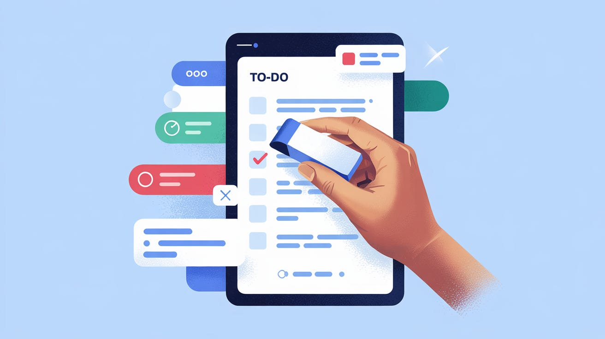

My life used to feel like I was always trying to keep too many balls in the air, all because of my long list of to-do's. I tried everything: fancy ways to rank tasks, scheduling apps, planning out every hour – all of it. I thought if I could just get _more organized_, I'd finally get some breathing room. Does that sound like you?

But no matter how well I arranged my tasks, the list never got shorter. New things always came up, taking the place of whatever I finished. I was getting better at _dealing_ with feeling overwhelmed, but I wasn't actually _less_ overwhelmed.

Then, I learned something simple but important: **Making priorities just changes the order of tasks; it doesn't make the list smaller.** That really hit home. I realized I wasn't struggling because I was messy; I was struggling because I had agreed to do too much.

What really changed things wasn't finding a better way to organize. It was learning to **subtract**. That meant actively _removing_ things from my list _before_ I even thought about when to do them. For me, this meant focusing on three things:

- **Eliminating/Ignoring:** Learning to say "no" or realizing some tasks just didn't need doing.
- **Delegating:** Asking others for help or letting them handle tasks.
- **Automating:** Using technology to handle the boring, repetitive stuff that tired me out.

Honestly, the idea of _reducing_ my list felt much better and more likely to work than just finding new ways to handle the same big pile of tasks.

## Changing My Focus: From Ordering to Reducing

So, I tried something new. Instead of putting new requests or ideas straight onto my list and deciding their importance, I made myself stop and ask some direct questions first:

- **"Does this _really_ need to be done?"** I was very honest with myself. Would anything bad happen if this didn't get done? Would the problem fix itself? Was it truly important, or did it just _feel_ like it had to be done right away? This helped me get rid of tasks that were just noise. _(Eliminate/Ignore)_

- **"Will doing this actually help me later on?"** I started thinking about the future. Was this task helping me reach my real goals, or was it just "busy work" keeping me occupied? I got rid of more tasks this way. _(Eliminate)_

- **"Could someone else do this well?"** This was tough at first – I like being in control. But I realized asking for help or passing tasks to others (even if they didn't do it _exactly_ my way) was really important. _(Delegate)_

- **"Can I automate this?"** I looked for tasks I did over and over – reports, emails, scheduling. Setting up simple automatic ways to do them felt like finding free time I didn't know I had. It took a little effort at the start but saved me lots of time later. _(Automate)_

Of course, I wasn't super strict. If something really took less than five minutes, I often just did it to clear my head. But using these "subtraction" questions for everything else _before_ it made it onto my main to-do list? That made a huge difference.

## The Result: Finding My Focus (and Calm)

The change didn't happen overnight, but after a few weeks, I felt things really shift. That constant feeling of being rushed and overwhelmed started to go away. I felt calmer, less pulled in different directions, and more focused on the work I _was_ doing.

Why? Because I wasn't just managing my work anymore; I was actively _making it less_. This didn't just give me back hours in my day; it gave me back _mental energy_. Energy I could now use for projects I cared about, things that made me feel good, and just being more present in my life.

It felt like learning to pause before automatically answering every phone call or email. That pause gave me the power to choose what I really wanted to do. Asking "Eliminate, Delegate, or Automate first?" became my new habit, and it gave me back a sense of control I hadn't realized I'd lost.

## Your Turn: Start Subtracting Today

Making priorities is still useful, but I learned it's not the answer to feeling constantly busy. It's a tool for managing what's _left_ after you've already cut things out. If you're tired of feeling buried under tasks, I suggest you change your focus from just ordering your list to actively shrinking it.

Ask yourself those direct questions. Be willing to let things go. You might be surprised how much lighter you feel, and how much time and energy you get back.

**What's one thing _you_ can eliminate, delegate, or automate today?** Give it a try – it changed everything for me.
