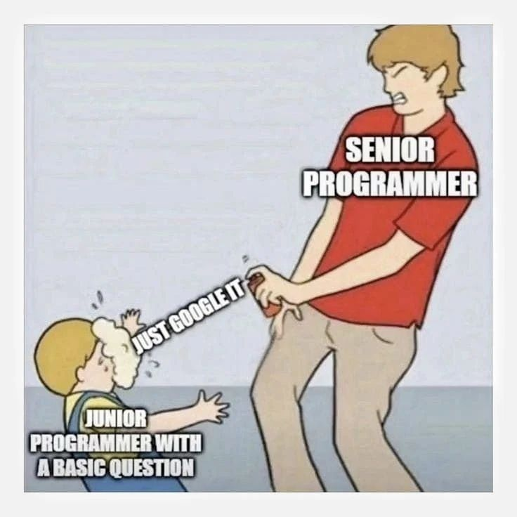

This meme brought back memories of my junior dev days 😅

Back then, whenever I approached my mentor or senior engineers with questions, the response was often: "just google it."

I felt dismissed.

I used to get annoyed.

I wanted the quick answer.

But looking back, I realize they were teaching me something invaluable: How to think and solve problems independently.

They only stepped in when I truly hit a wall, offering guidance first, then pairing with me if needed.

Now, even as an experienced engineer with many failures, I still google.

I still ask simple questions.

I still search for that specific syntax.

So what is the difference?

I am better at asking the right questions.

I am better at identifying what to look for.

I know when to seek guidance and pair with others.

Letting people struggle triggers critical thinking and builds problem solving skills. Not every challenge should be served on a silver platter. We need space to try, fail, and improve.
