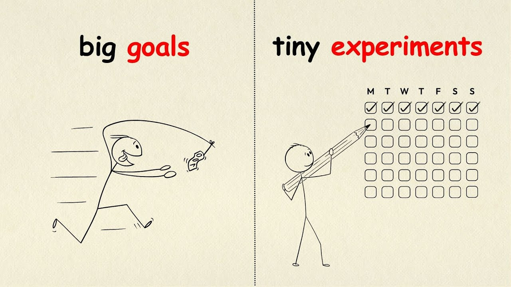

The most productive people I know don't always follow their plans.

They break them.

Here's the thing most productivity advice gets wrong.

We're told to set goals, make plans, and execute relentlessly. But this creates what I call "The Execution Trap" - you become so focused on the roadmap that you miss the breakthrough hiding in the detour.

Some of my biggest wins came from "useless" side projects and experiments.

That weekend I spent exploring Raycast? Now everything I need is accessible through keyboard shortcuts. No context switching. No opening browsers. Just fast, integrated workflows.

Or the weekend I explored Cursor Background Agents? Now I delegate entire features to AI. What used to take days now takes minutes in background.

The experiments that seemed pointless at the time became the fuel that matters most.

Here's how to balance execution with exploration:

## ➤ Run tiny experiments

Commit to testing something new for a fixed duration (1 week, 10 days, 20 sessions). No pressure to continue forever.

## ➤ Track what energizes you

Not just what's productive. Energy is data. If a side quest lights you up, that's a signal.

## ➤ Give yourself permission to pivot

An experiment that "fails" still teaches you something. There's no wasted effort in learning.

## ➤ Protect exploration time

Block 2-3 hours weekly for curiosity-driven work. Treat it as non-negotiable.

## ➤ Celebrate the spark

The random idea, the weird tool, the deviation that doesn't fit your goals. That's where breakthroughs live.

I'm not saying abandon your plans.

I'm saying leave room for the detours that can change everything.

Experiment, explore, and try new approaches.
