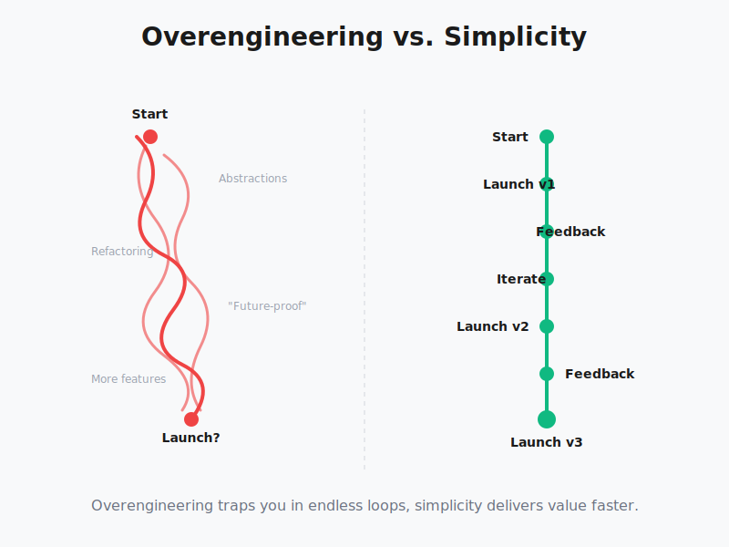

After 10+ years building software, I still catch myself overengineering.

Recently, I refactored a project three times. Each time, I found a "better" structure. More abstractions. More flexibility. More "future-proof."

I was building features no one asked for.

I deleted most of the code and went back to simple.

Here's the thing: we engineers love complexity. It's fun. It's challenging. It gives us that dopamine hit.

But while we're perfecting the architecture, users are waiting for features that solve their actual problems.

Here's what todo instead:

## ➤ Start Simple and Ship Fast

Run a monolith on a single server. Build the bare minimum that solves the core problem.

Serve your first 100 users with the simplest solution possible.

Ship it. Get it in their hands.

## ➤ Let Users Tell You What They Need

Don't build features based on "what if" scenarios. Build based on what users actually request.

Real user feedback beats engineering assumptions every single time.

When you ship fast, you learn fast.

## ➤ Scale Based on Real Demand

When traffic grows, scale what you have. When users ask for specific features, build those features.

Not the ones you think they might need someday.

## ➤ Evolve When You're Successful

When money is flowing and the project is thriving, invest in robust infrastructure.

Not before.

In my experience: Most projects die from complexity, not simplicity. Most features we "future-proof" never get used.

The best code is the code that ships and gets feedback.

Be simple. Ship fast. Listen to users. Iterate based on reality.
